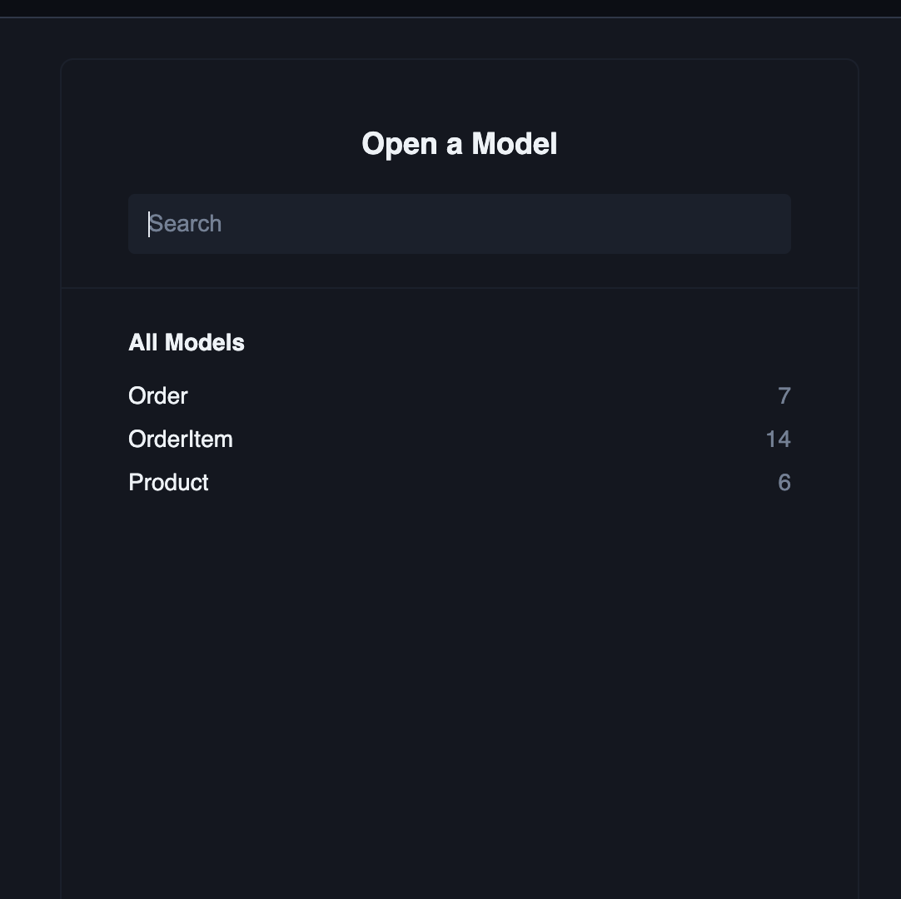

# Hacktoberfest 2022 Thailand Prisma ORM challenge

**Please Fork this repo for creating PR**

## How to create PR **Please Watch Before Start The Challenge**

https://www.loom.com/share/7b4dbd89758a4f049ef6bb06e86b9680

## Setup

1. install dependecies

   **pnpm**
   `pnpm install`

   **npm**
   `npm install`

   **yarn**
   `yarn install`
    

2. run migration files

   **pnpm**
   `pnpm run migrate`

   **npm**
   `npm run migrate`

   **yarn**
   `yarn run migrate`
    

3. run seeding data to SQLite database

   **pnpm**
   `pnpm run seed`

   **npm**
   `npm run seed`

   **yarn**
   `yarn run seed`
    

4. run prisma studio to check

   **pnpm**
   `pnpm run studio`

   **npm**
   `npm run studio`

   **yarn**
   `yarn run studio`

    
   

## Challenge Questions

1. count how many delivered order
2. count how many processing order
3. count how many delivered orders that have product a
4. get all products that have price greater than 30
5. get all products name that have price less than or equal 30, and select only name
